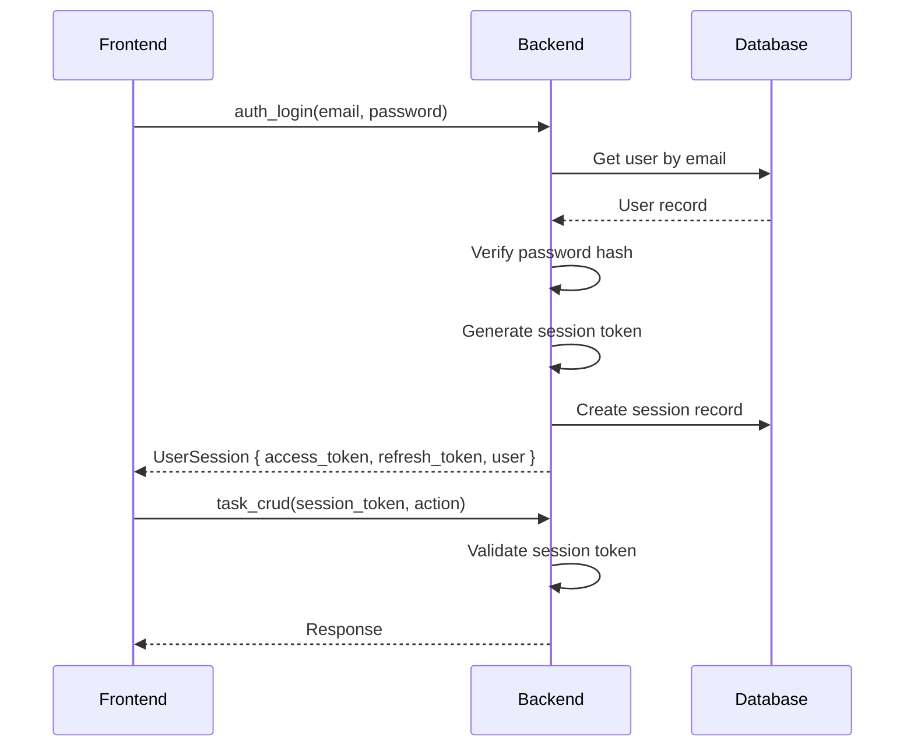

# RPMA v2 - API Documentation

## Table of Contents

- [Introduction](#introduction)
- [Architecture](#architecture)
- [Authentication](#authentication)
- [Authorization](#authorization)
- [Request/Response Formats](#requestresponse-formats)
- [Validation](#validation)
- [Error Handling](#error-handling)
- [API Commands](#api-commands)
- [WebSocket API](#websocket-api)
- [External Integrations](#external-integrations)

## Introduction

This document provides comprehensive documentation for the **RPMA v2** API. The application uses **Tauri IPC (Inter-Process Communication)** for communication between the frontend (Next.js/React) and backend (Rust).

### API Overview

- **Protocol**: Tauri IPC (JSON over WebSockets)
- **Base URL**: Internal IPC (not exposed externally)
- **Data Format**: JSON (with MessagePack support)
- **Compression**: Automatic Gzip for payloads > 1KB
- **Streaming**: Chunked transfer for large payloads (> 10MB)
- **Rate Limiting**: 100 req/min (client ops), 200 req/min (calendar ops)

### Key Features

- **Session-Based Authentication**: JWT tokens with refresh mechanism
- **Role-Based Access Control (RBAC)**: Admin, Supervisor, Technician, Viewer
- **Two-Factor Authentication (2FA)**: Optional TOTP-based 2FA
- **Comprehensive Validation**: Input validation via ValidationService
- **Structured Error Handling**: Consistent error codes and messages
- **Offline-First Queue**: Persistent sync queue for offline operations
- **Real-Time Updates**: WebSocket support for live updates

## Architecture

### Communication Flow

```
┌─────────────────────────────────────────────────────────────────┐
│                     Frontend (React)                           │
│  ┌──────────────┐  ┌──────────────┐  ┌──────────────┐        │
│  │   Components │  │  IPC Client  │  │    State    │        │
│  └──────────────┘  └──────────────┘  └──────────────┘        │
└──────────────────────────────┬──────────────────────────────────┘
                               │
                    ┌──────────▼──────────┐
                    │   Tauri IPC Layer  │
                    │   (WebSockets)     │
                    └──────────┬──────────┘
                               │
┌──────────────────────────────▼──────────────────────────────────┐
│                    Backend (Rust)                              │
│  ┌──────────────┐  ┌──────────────┐  ┌──────────────┐        │
│  │  Commands    │  │   Services   │  │ Repositories │        │
│  │  (IPC)       │  │              │  │              │        │
│  └──────────────┘  └──────────────┘  └──────────────┘        │
│  ┌──────────────┐  ┌──────────────┐  ┌──────────────┐        │
│  │  Models      │  │ Validation   │  │   Cache     │        │
│  └──────────────┘  └──────────────┘  └──────────────┘        │
└──────────────────────────────┬──────────────────────────────────┘
                               │
                    ┌──────────▼──────────┐
                    │    SQLite Database  │
                    └─────────────────────┘
```

### Command Registration

All IPC commands are registered in `src-tauri/src/main.rs`:

```rust
#[tauri::command]
async fn command_name(
    // parameters
    session_token: String,
    app_state: State<'_, AppStateType>
) -> Result<ApiResponse<DataType>, AppError> {
    // implementation
}
```

### Frontend IPC Client

Frontend uses `ipcClient` from `frontend/src/lib/ipc/client.ts`:

```typescript
import { ipcClient } from '@/lib/ipc/client';

const response = await ipcClient.tasks.get(taskId, sessionToken);
```

## Authentication

### Session-Based Authentication

RPMA uses **session-based authentication** with JSON Web Tokens (JWT).

#### Authentication Flow



#### Login Request

```typescript
interface LoginRequest {
  email: string;
  password: string;
  correlation_id?: string;
}
```

**Validation**:
- `email`: Required, valid email format (RFC 5322), max 254 characters
- `password`: Required, min 8 characters, 3 of 4 character types

#### Login Response

```typescript
interface LoginResponse {
  access_token: string;        // JWT token for API calls
  refresh_token: string;       // Token for refreshing expired sessions
  user: {
    id: string;
    email: string;
    username: string;
    full_name: string;
    role: UserRole;
  };
  expires_at: number;          // Unix timestamp in milliseconds
}
```

#### Session Token

- **Algorithm**: HS256
- **Expiry**: 8 hours (configurable)
- **Payload**: User ID, role, issue time, expiry time
- **Storage**: In-memory on frontend

#### Refresh Token

- **Expiry**: 30 days (configurable)
- **Purpose**: Refresh expired access tokens without re-authentication
- **Storage**: In-memory on frontend

### Password Hashing

Passwords are hashed using **Argon2id** with the following parameters:

- **Memory cost**: 32 MB
- **Time cost**: 3 iterations
- **Parallelism**: 4 threads
- **Salt length**: 16 bytes
- **Hash length**: 32 bytes

## Authorization

### Role-Based Access Control (RBAC)

RPMA implements a hierarchical role system with the following roles:

| Role | Description | Permissions |
|------|-------------|--------------|
| **Admin** | Full system access | Create, Read, Update, Delete all entities (except self deletion) |
| **Supervisor** | Management role | Create, Read, Update tasks, clients, messages. View all reports. |
| **Technician** | Field worker | Create, Read, Update assigned tasks and photos. |
| **Viewer** | Read-only | Read all entities. No write access. |

### Permission Matrix

| Operation | Admin | Supervisor | Technician | Viewer |
|-----------|-------|------------|------------|--------|
| Create Task | ✓ | ✓ | ✓ | ✗ |
| Read Task | ✓ | ✓ | ✓ | ✓ |
| Update Task | ✓ | ✓ | ✓ (assigned) | ✗ |
| Delete Task | ✓ | ✗ | ✗ | ✗ |
| Assign Task | ✓ | ✓ | ✗ | ✗ |
| Start Intervention | ✓ | ✓ | ✓ (assigned) | ✗ |
| Upload Photos | ✓ | ✓ | ✓ (assigned) | ✗ |
| Create Client | ✓ | ✓ | ✗ | ✗ |
| Read Client | ✓ | ✓ | ✓ | ✓ |
| Update Client | ✓ | ✓ | ✗ | ✗ |
| Delete Client | ✓ | ✗ | ✗ | ✗ |
| Create User | ✓ | ✗ | ✗ | ✗ |
| Update User | ✓ | Self only | ✗ | ✗ |
| Delete User | ✓ | ✗ | ✗ | ✗ |
| View Reports | ✓ | ✓ | Own only | ✓ |
| Export Reports | ✓ | ✓ | ✗ | ✗ |

### Permission Check Implementation

Backend checks permissions in command handlers:

```rust
// Example: Task update
async fn update_task(task_id: String, user_id: String, session_token: String) -> Result<Task, AppError> {
    let session = validate_session(session_token)?;
    let task = get_task(task_id)?;

    match session.user.role {
        UserRole::Admin => { /* Allow */ },
        UserRole::Supervisor => { /* Allow */ },
        UserRole::Technician => {
            if task.technician_id != Some(user_id) {
                return Err(AppError::Authorization("Not assigned to this task".to_string()));
            }
        },
        UserRole::Viewer => {
            return Err(AppError::Authorization("Read-only access".to_string()));
        },
    }

    // Proceed with update
}
```

## Request/Response Formats

### Standard API Response

All API responses follow a consistent format:

```typescript
interface ApiResponse<T> {
  success: boolean;
  data?: T;
  error?: ApiError;
  correlation_id?: string;      // Request tracing
  timestamp: number;            // Unix milliseconds
}
```

#### Success Response

```json
{
  "success": true,
  "data": {
    "id": "550e8400-e29b-41d4-a716-446655440000",
    "title": "PPF Installation - 2024 ABC 123",
    "status": "scheduled"
  },
  "correlation_id": "req_abc123",
  "timestamp": 1704067200000
}
```

#### Error Response

```json
{
  "success": false,
  "error": {
    "message": "Task not found",
    "code": "NOT_FOUND",
    "details": {
      "task_id": "550e8400-e29b-41d4-a716-446655440000"
    }
  },
  "correlation_id": "req_abc123",
  "timestamp": 1704067200000
}
```

### ApiError Structure

```typescript
interface ApiError {
  message: string;             // User-friendly error message
  code: string;               // Error code (see Error Handling section)
  details?: any;              // Additional error context
  stack_trace?: string;       // Stack trace (debug builds only)
}
```

### Compressed Response

For large payloads (> 1KB), responses are automatically compressed:

```typescript
interface CompressedApiResponse {
  success: boolean;
  compressed: boolean;
  data?: string;              // base64-encoded gzipped data
  error?: ApiError;
  correlation_id?: string;
  timestamp: number;
}
```

**Decompression** (frontend):

```typescript
import { decompressDataFromIpc } from '@/lib/ipc/compression';

const response = await invoke('command_name');
if (response.compressed) {
  const data = decompressDataFromIpc(response);
}
```

### Streaming Response

For very large payloads (> 10MB), data is transferred in chunks:

```typescript
interface StreamMetadata {
  stream_id: string;
  total_size: number;
  total_chunks: number;
  chunk_size: number;          // Default: 1MB
  content_type: string;
  checksum: string;           // SHA256 for integrity
}

interface StreamChunk {
  stream_id: string;
  chunk_index: number;
  data: Uint8Array;
  is_last: boolean;
}
```

**Streaming Flow**:

```typescript
// 1. Start stream
const metadata = await invoke('start_stream_transfer', {
  stream_id: generateId(),
  total_size: data.length,
});

// 2. Send chunks
for (let i = 0; i < chunks.length; i++) {
  await invoke('send_stream_chunk', {
    stream_id: metadata.stream_id,
    chunk_index: i,
    chunk_data: chunks[i],
  });
}

// 3. Retrieve stream
const streamData = await invoke('get_stream_data', {
  stream_id: metadata.stream_id,
});

// 4. Verify checksum
const computedChecksum = sha256(streamData);
if (computedChecksum !== metadata.checksum) {
  throw new Error('Checksum mismatch');
}
```

### MessagePack Support

For efficient data transfer, MessagePack binary format is supported:

```typescript
// Request with MessagePack
const request = msgpack.encode({
  task_id: "550e8400-e29b-41d4-a716-446655440000",
  session_token: "jwt_token_here",
});

const response = await invoke('command_name', {
  format: 'messagepack',
  data: request,
});

// Decode response
const data = msgpack.decode(response.data);
```

## Validation

### ValidationService

The `ValidationService` provides centralized validation for all user inputs.

#### Validation Methods

##### Email Validation

```typescript
function validateEmailSecure(email: string): ValidationResult {
  // Rules:
  // - RFC 5322 format
  // - Max 254 characters
  // - Lowercase
  // - No suspicious patterns (script, javascript)

  const regex = /^[a-zA-Z0-9.!#$%&'*+/=?^_`{|}~-]+@[a-zA-Z0-9](?:[a-zA-Z0-9-]{0,61}[a-zA-Z0-9])?(?:\.[a-zA-Z0-9](?:[a-zA-Z0-9-]{0,61}[a-zA-Z0-9])?)*$/;
  return regex.test(email);
}
```

##### Password Validation

```typescript
function validatePasswordEnhanced(password: string): ValidationResult {
  // Rules:
  // - Min 8 characters, max 128
  // - Must contain 3 of: uppercase, lowercase, number, special
  // - No common patterns (password, 123456, qwerty)
  // - No 4+ consecutive identical characters

  if (password.length < 8 || password.length > 128) {
    return { valid: false, error: "Password must be 8-128 characters" };
  }

  const charTypes = {
    uppercase: /[A-Z]/.test(password),
    lowercase: /[a-z]/.test(password),
    number: /[0-9]/.test(password),
    special: /[!@#$%^&*()_+\-=\[\]{};':"\\|,.<>\/?]/.test(password),
  };

  const hasThreeTypes = Object.values(charTypes).filter(Boolean).length >= 3;
  if (!hasThreeTypes) {
    return { valid: false, error: "Password must contain 3 of: uppercase, lowercase, number, special" };
  }

  // Check for common patterns
  const commonPatterns = ['password', '123456', 'qwerty', 'admin'];
  if (commonPatterns.some(pattern => password.toLowerCase().includes(pattern))) {
    return { valid: false, error: "Password contains common pattern" };
  }

  // Check for consecutive identical characters
  const consecutiveRegex = /(.)\1{3,}/;
  if (consecutiveRegex.test(password)) {
    return { valid: false, error: "Password contains 4+ consecutive identical characters" };
  }

  return { valid: true };
}
```

##### Username Validation

```typescript
function validateUsername(username: string): ValidationResult {
  // Rules:
  // - 3-50 characters
  // - Alphanumeric, underscore, hyphen only
  // - Must start with letter

  const regex = /^[a-zA-Z][a-zA-Z0-9_-]{2,49}$/;
  return regex.test(username);
}
```

##### Name Validation

```typescript
function validateName(name: string): ValidationResult {
  // Rules:
  // - 2-100 characters
  // - Letters (including accented), spaces, hyphens, apostrophes only

  const regex = /^[a-zA-Zà-žÀ-Ž\s\-']{2,100}$/;
  return regex.test(name);
}
```

##### GPS Coordinates Validation

```typescript
function validateGpsCoordinates(lat: number, lon: number): ValidationResult {
  // Rules:
  // - Latitude: -90 to 90
  // - Longitude: -180 to 180

  if (lat < -90 || lat > 90) {
    return { valid: false, error: "Latitude must be between -90 and 90" };
  }
  if (lon < -180 || lon > 180) {
    return { valid: false, error: "Longitude must be between -180 and 180" };
  }
  return { valid: true };
}
```

##### GPS Accuracy Validation

```typescript
function validateGpsAccuracy(accuracy: number, maxAllowed: number = 100): ValidationResult {
  // Rules:
  // - Accuracy must be <= maxAllowed (default 100m)

  if (accuracy > maxAllowed) {
    return { valid: false, error: `GPS accuracy ${accuracy}m exceeds maximum ${maxAllowed}m` };
  }
  return { valid: true };
}
```

##### GPS Freshness Validation

```typescript
function validateGpsFreshness(timestamp: number, maxAge: number = 600000): ValidationResult {
  // Rules:
  // - Timestamp must be within maxAge (default 10 minutes = 600000ms)

  const age = Date.now() - timestamp;
  if (age > maxAge) {
    return { valid: false, error: `GPS location ${Math.round(age / 60000)} minutes old exceeds maximum ${maxAge / 60000} minutes` };
  }
  return { valid: true };
}
```

### Input Sanitization

Dangerous characters are removed from text inputs:

```typescript
function sanitizeTextInput(input: string, maxLength: number): string {
  // Remove:
  // - Null bytes (\0)
  // - Control characters (except whitespace)
  // - HTML tags: <, >, ", ', &

  let sanitized = input
    .replace(/\0/g, '')
    .replace(/[\x01-\x08\x0B\x0C\x0E-\x1F\x7F]/g, '')
    .replace(/</g, '&lt;')
    .replace(/>/g, '&gt;')
    .replace(/"/g, '&quot;')
    .replace(/'/g, '&#x27;')
    .replace(/&/g, '&amp;');

  // Normalize whitespace
  sanitized = sanitized.replace(/\s+/g, ' ').trim();

  // Truncate to max length
  if (sanitized.length > maxLength) {
    sanitized = sanitized.substring(0, maxLength);
  }

  return sanitized;
}
```

## Error Handling

### AppError Enum

Comprehensive error types with HTTP status mapping:

```typescript
enum AppError {
  // Client Errors (4xx)
  Authentication(string),        // 401
  Authorization(string),         // 403
  Validation(string),            // 400
  NotFound(string),              // 404
  RateLimit(string),             // 429

  // Server Errors (5xx)
  Database(string),             // 500
  Internal(string),             // 500
  Network(string),              // 500
  Io(string),                  // 500
  Configuration(string),        // 500
  Sync(string),                // 500

  // Intervention-specific
  InterventionAlreadyActive(string),
  InterventionInvalidState(string),
  InterventionStepNotFound(string),
  InterventionValidationFailed(string),
  InterventionConcurrentModification(string),
  InterventionTimeout(string),
  InterventionStepOutOfOrder(string),

  NotImplemented(string),
}
```

### Error Codes

| Error Code | HTTP Status | Description |
|------------|-------------|-------------|
| `AUTH_INVALID` | 401 | Invalid email or password |
| `AUTH_FORBIDDEN` | 403 | Insufficient permissions |
| `AUTH_SESSION_EXPIRED` | 401 | Session token expired |
| `AUTH_SESSION_INVALID` | 401 | Invalid session token |
| `VALIDATION_ERROR` | 400 | Input validation failed |
| `VALIDATION_EMAIL_INVALID` | 400 | Invalid email format |
| `VALIDATION_PASSWORD_WEAK` | 400 | Password too weak |
| `VALIDATION_PASSWORD_MISMATCH` | 400 | Passwords do not match |
| `NOT_FOUND` | 404 | Resource not found |
| `NOT_FOUND_USER` | 404 | User not found |
| `NOT_FOUND_TASK` | 404 | Task not found |
| `NOT_FOUND_CLIENT` | 404 | Client not found |
| `DATABASE_ERROR` | 500 | Database operation failed |
| `DATABASE_CONNECTION` | 500 | Database connection failed |
| `INTERNAL_ERROR` | 500 | Internal server error |
| `NETWORK_ERROR` | 500 | Network request failed |
| `RATE_LIMIT` | 429 | Too many requests |
| `INTERVENTION_ALREADY_ACTIVE` | 400 | Task already has active intervention |
| `INTERVENTION_INVALID_STATE` | 400 | Intervention in invalid state for operation |
| `INTERVENTION_STEP_OUT_OF_ORDER` | 400 | Cannot skip mandatory step |

### Error Response Format

```json
{
  "success": false,
  "error": {
    "message": "Task not found",
    "code": "NOT_FOUND_TASK",
    "details": {
      "task_id": "550e8400-e29b-41d4-a716-446655440000"
    }
  },
  "timestamp": 1704067200000
}
```

### Error Handling Flow

```
Frontend Request
    ↓
Validate Input (Client-side)
    ↓
Send to Backend (IPC)
    ↓
Validate Session
    ↓
Validate Permissions
    ↓
Validate Input (Server-side)
    ↓
Execute Operation
    ↓
Return Success Response OR Error Response
    ↓
Frontend Display Error (if any)
```

## API Commands

This section documents all Tauri IPC commands organized by functional module.

### Auth Commands

#### auth_login

**Description**: Authenticate user with email and password.

**Request**:
```typescript
interface AuthLoginRequest {
  email: string;
  password: string;
  correlation_id?: string;
}
```

**Response**:
```typescript
interface AuthLoginResponse {
  access_token: string;
  refresh_token: string;
  user: UserAccount;
  expires_at: number;
}
```

**Validation**:
- `email`: Valid email format, max 254 chars
- `password`: Min 8 chars, 3 of 4 char types

**Errors**:
- `AUTH_INVALID`: Invalid email or password
- `VALIDATION_EMAIL_INVALID`: Invalid email format
- `VALIDATION_PASSWORD_WEAK`: Password too weak

**Example**:
```typescript
const response = await ipcClient.auth.login('user@example.com', 'securePassword123!');
```

---

#### auth_create_account

**Description**: Create new user account with auto-login.

**Request**:
```typescript
interface AuthCreateAccountRequest {
  email: string;
  first_name: string;
  last_name: string;
  password: string;
  role?: UserRole;
  correlation_id?: string;
}
```

**Response**:
```typescript
interface AuthCreateAccountResponse {
  user: UserAccount;
  access_token: string;
  refresh_token: string;
  expires_at: number;
}
```

**Validation**:
- `email`: Valid email format, unique
- `first_name`: 2-100 chars, letters/spaces
- `last_name`: 2-100 chars, letters/spaces
- `password`: Min 8 chars, 3 of 4 char types
- `role`: Optional, default `technician`

**Errors**:
- `VALIDATION_EMAIL_INVALID`: Invalid email format
- `VALIDATION_EMAIL_TAKEN`: Email already in use
- `VALIDATION_PASSWORD_WEAK`: Password too weak

**Permissions**: Open (first-time setup) or Admin

**Example**:
```typescript
const response = await ipcClient.auth.createAccount({
  email: 'newuser@example.com',
  first_name: 'John',
  last_name: 'Doe',
  password: 'SecurePass123!',
  role: 'technician',
});
```

---

#### auth_logout

**Description**: End user session.

**Request**:
```typescript
interface AuthLogoutRequest {
  token: string;
}
```

**Response**: `void`

**Example**:
```typescript
await ipcClient.auth.logout(sessionToken);
```

---

#### auth_validate_session

**Description**: Verify session token is still valid.

**Request**:
```typescript
interface AuthValidateSessionRequest {
  token: string;
}
```

**Response**:
```typescript
interface AuthValidateSessionResponse {
  user: UserAccount;
  expires_at: number;
}
```

**Errors**:
- `AUTH_SESSION_EXPIRED`: Session expired
- `AUTH_SESSION_INVALID`: Invalid session token

**Example**:
```typescript
const session = await ipcClient.auth.validateSession(sessionToken);
```

---

#### auth_refresh_token

**Description**: Refresh expired access token using refresh token.

**Request**:
```typescript
interface AuthRefreshTokenRequest {
  refresh_token: string;
}
```

**Response**:
```typescript
interface AuthRefreshTokenResponse {
  access_token: string;
  refresh_token: string;
  expires_at: number;
}
```

**Errors**:
- `AUTH_SESSION_EXPIRED`: Refresh token expired
- `AUTH_SESSION_INVALID`: Invalid refresh token

**Example**:
```typescript
const tokens = await ipcClient.auth.refreshToken(refreshToken);
```

---

#### enable_2fa

**Description**: Generate 2FA setup data (QR code, secret).

**Request**:
```typescript
interface Enable2FARequest {
  session_token: string;
}
```

**Response**:
```typescript
interface TwoFactorSetup {
  secret: string;           // TOTP secret (base32)
  qr_code_url: string;     // QR code image URL
  backup_codes: string[];  // 10 backup codes
}
```

**Errors**:
- `AUTH_FORBIDDEN`: Not authenticated
- `2FA_ALREADY_ENABLED`: 2FA already enabled

**Permissions**: Authentication required

**Example**:
```typescript
const setup = await ipcClient.auth.enable2FA(sessionToken);
// Display QR code to user, save backup codes securely
```

---

#### verify_2fa_setup

**Description**: Verify 2FA code to enable 2FA.

**Request**:
```typescript
interface Verify2FASetupRequest {
  user_id: string;
  code: string;
  session_token: string;
}
```

**Response**: `boolean` (true if successful)

**Validation**:
- `code`: 6 digits, valid TOTP code

**Errors**:
- `AUTH_FORBIDDEN`: Not authenticated
- `2FA_INVALID_CODE`: Invalid verification code

**Permissions**: Authentication required

**Example**:
```typescript
const success = await ipcClient.auth.verify2FASetup(userId, '123456', sessionToken);
```

---

#### disable_2fa

**Description**: Disable 2FA for user.

**Request**:
```typescript
interface Disable2FARequest {
  password: string;
  session_token: string;
}
```

**Response**: `string` (success message)

**Errors**:
- `AUTH_FORBIDDEN`: Not authenticated
- `AUTH_INVALID`: Invalid password

**Permissions**: Authentication required

**Example**:
```typescript
await ipcClient.auth.disable2FA('currentPassword', sessionToken);
```

---

#### regenerate_backup_codes

**Description**: Generate new 2FA backup codes.

**Request**:
```typescript
interface RegenerateBackupCodesRequest {
  session_token: string;
}
```

**Response**:
```typescript
string[];  // 10 new backup codes
```

**Permissions**: Authentication required

**Example**:
```typescript
const backupCodes = await ipcClient.auth.regenerateBackupCodes(sessionToken);
```

---

#### verify_2fa_code

**Description**: Verify 2FA code during login.

**Request**:
```typescript
interface Verify2FACodeRequest {
  code: string;
  session_token: string;
}
```

**Response**: `boolean`

**Permissions**: Authentication required

**Example**:
```typescript
const valid = await ipcClient.auth.verify2FACode('123456', sessionToken);
```

---

#### is_2fa_enabled

**Description**: Check if 2FA is enabled for user.

**Request**:
```typescript
interface Is2FAEnabledRequest {
  session_token: string;
}
```

**Response**: `boolean`

**Permissions**: Authentication required

**Example**:
```typescript
const enabled = await ipcClient.auth.is2FAEnabled(sessionToken);
```

---

### Task Commands

#### task_crud

**Description**: Unified CRUD operations for tasks.

**Request**:
```typescript
interface TaskCrudRequest {
  action: TaskAction;
  session_token: string;
  data?: any;              // Action-specific data
  filters?: TaskQuery;       // For list action
  pagination?: Pagination;   // For list action
  correlation_id?: string;
}

enum TaskAction {
  Create,
  Get,
  Update,
  Delete,
  List,
  Statistics,
}

interface Pagination {
  page: number;
  page_size: number;
}

interface TaskQuery {
  status?: TaskStatus[];
  priority?: TaskPriority[];
  technician_id?: string;
  client_id?: string;
  date_range?: { start: Date; end: Date };
  search?: string;
  sort_by?: string;
  sort_order?: 'asc' | 'desc';
}
```

**Response**:
```typescript
interface TaskResponse {
  task?: Task;
  tasks?: Task[];
  statistics?: TaskStatistics;
  message?: string;
}

interface TaskStatistics {
  total: number;
  by_status: Record<TaskStatus, number>;
  by_priority: Record<TaskPriority, number>;
  by_technician: Record<string, number>;
  overdue: number;
  completed_this_week: number;
  completed_this_month: number;
}
```

**Actions**:

##### Create
```typescript
const response = await ipcClient.tasks.create({
  title: 'PPF Installation',
  vehicle_plate: 'ABC-123',
  vehicle_make: 'Toyota',
  vehicle_model: 'Camry',
  client_id: 'client_id',
  scheduled_date: '2024-01-15',
  priority: 'high',
}, sessionToken);
```

##### Get
```typescript
const task = await ipcClient.tasks.get('task_id', sessionToken);
```

##### Update
```typescript
const updated = await ipcClient.tasks.update('task_id', {
  status: 'in_progress',
  notes: 'Installation started',
}, sessionToken);
```

##### Delete
```typescript
await ipcClient.tasks.delete('task_id', sessionToken);
```

##### List
```typescript
const response = await ipcClient.tasks.list({
  filters: {
    status: ['scheduled', 'in_progress'],
    technician_id: 'technician_id',
  },
  pagination: {
    page: 1,
    page_size: 20,
  },
}, sessionToken);
```

##### Statistics
```typescript
const stats = await ipcClient.tasks.statistics(sessionToken);
```

**Permissions**:
- Create: Admin, Supervisor, Technician
- Read: All roles
- Update: Admin, Supervisor, Technician (assigned only)
- Delete: Admin only
- List: All roles
- Statistics: All roles

**Example**:
```typescript
const response = await invoke('task_crud', {
  action: 'Create',
  session_token: sessionToken,
  data: {
    title: 'PPF Installation',
    vehicle_plate: 'ABC-123',
    vehicle_make: 'Toyota',
    vehicle_model: 'Camry',
    client_id: 'client_id',
    scheduled_date: '2024-01-15',
  },
});
```

---

#### edit_task

**Description**: Edit task details.

**Request**:
```typescript
interface EditTaskRequest {
  task_id: string;
  data: Partial<Task>;       // Fields to update
  session_token: string;
  correlation_id?: string;
}
```

**Response**: `Task`

**Permissions**: Admin, Supervisor, Technician (assigned only)

**Example**:
```typescript
const updated = await ipcClient.tasks.editTask('task_id', {
  status: 'in_progress',
  notes: 'Installation started',
}, sessionToken);
```

---

#### delay_task

**Description**: Reschedule task with reason.

**Request**:
```typescript
interface DelayTaskRequest {
  task_id: string;
  new_scheduled_date: string;
  reason: string;
  additional_notes?: string;
  session_token: string;
  correlation_id?: string;
}
```

**Response**: `Task`

**Validation**:
- `new_scheduled_date`: Valid future date
- `reason`: Required, max 500 chars

**Permissions**: Admin, Supervisor, Technician (assigned only)

**Example**:
```typescript
const delayed = await ipcClient.tasks.delayTask('task_id', '2024-01-20', 'Customer requested reschedule', sessionToken);
```

---

#### export_tasks_csv

**Description**: Export tasks to CSV format.

**Request**:
```typescript
interface ExportTasksCsvRequest {
  filter?: TaskQuery;
  include_client_data?: boolean;
  session_token: string;
  correlation_id?: string;
}
```

**Response**: `string` (CSV data)

**Permissions**: Admin, Supervisor

**Example**:
```typescript
const csv = await ipcClient.tasks.exportTasksCsv({
  filter: {
    status: ['completed'],
    date_range: { start: '2024-01-01', end: '2024-01-31' },
  },
  include_client_data: true,
}, sessionToken);
```

---

#### import_tasks_bulk

**Description**: Bulk import tasks from CSV data.

**Request**:
```typescript
interface ImportTasksBulkRequest {
  csv_data: string;
  update_existing?: boolean;
  session_token: string;
  correlation_id?: string;
}
```

**Response**:
```typescript
interface BulkImportResponse {
  imported: number;
  updated: number;
  failed: number;
  errors: string[];
}
```

**Permissions**: Admin, Supervisor

**Example**:
```typescript
const result = await ipcClient.tasks.importTasksBulk(csvData, false, sessionToken);
```

---

#### check_task_assignment

**Description**: Check if task can be assigned to technician.

**Request**:
```typescript
interface CheckTaskAssignmentRequest {
  task_id: string;
  user_id: string;
}
```

**Response**:
```typescript
interface AssignmentCheckResponse {
  can_assign: boolean;
  conflicts?: string[];
}
```

**Example**:
```typescript
const check = await ipcClient.tasks.checkTaskAssignment('task_id', 'user_id');
```

---

#### check_task_availability

**Description**: Check if task is available for intervention.

**Request**:
```typescript
interface CheckTaskAvailabilityRequest {
  task_id: string;
}
```

**Response**:
```typescript
interface AvailabilityCheckResponse {
  is_available: boolean;
  reason?: string;
  active_intervention?: Intervention;
}
```

**Example**:
```typescript
const check = await ipcClient.tasks.checkTaskAvailability('task_id');
```

---

### Client Commands

#### client_crud

**Description**: Unified CRUD operations for clients.

**Request**:
```typescript
interface ClientCrudRequest {
  action: ClientAction;
  session_token: string;
  data?: any;
  filters?: ClientQuery;
  pagination?: Pagination;
  correlation_id?: string;
}

enum ClientAction {
  Create,
  Get,
  GetWithTasks,
  Update,
  Delete,
  List,
  ListWithTasks,
  Search,
  Stats,
}

interface ClientQuery {
  customer_type?: CustomerType[];
  search?: string;
  sort_by?: string;
  sort_order?: 'asc' | 'desc';
}
```

**Response**:
```typescript
interface ClientResponse {
  client?: Client;
  clients?: Client[];
  client_with_tasks?: ClientWithTasks;
  clients_with_tasks?: ClientWithTasks[];
  statistics?: ClientStatistics;
  message?: string;
}

interface ClientWithTasks extends Client {
  tasks: Task[];
}

interface ClientStatistics {
  total_clients: number;
  by_type: Record<CustomerType, number>;
  new_this_month: number;
  top_clients: Array<{ client_id: string, task_count: number }>;
}
```

**Actions**:

##### Create
```typescript
const response = await ipcClient.clients.create({
  name: 'John Doe',
  email: 'john@example.com',
  phone: '+1234567890',
  customer_type: 'individual',
}, sessionToken);
```

##### Get
```typescript
const client = await ipcClient.clients.get('client_id', sessionToken);
```

##### GetWithTasks
```typescript
const client = await ipcClient.clients.getWithTasks('client_id', sessionToken);
```

##### Update
```typescript
const updated = await ipcClient.clients.update('client_id', {
  phone: '+9876543210',
}, sessionToken);
```

##### Delete
```typescript
await ipcClient.clients.delete('client_id', sessionToken);
```

##### List
```typescript
const response = await ipcClient.clients.list({
  filters: {
    customer_type: ['individual'],
  },
  pagination: { page: 1, page_size: 20 },
}, sessionToken);
```

##### ListWithTasks
```typescript
const response = await ipcClient.clients.listWithTasks({
  pagination: { page: 1, page_size: 20 },
}, sessionToken);
```

##### Search
```typescript
const response = await ipcClient.clients.search('John Doe', 10, sessionToken);
```

##### Stats
```typescript
const stats = await ipcClient.clients.stats(sessionToken);
```

**Permissions**:
- Create, Update, Delete: Admin, Supervisor
- Read: All roles
- Search: All roles
- Stats: All roles

---

### Intervention Commands

#### intervention_start

**Description**: Start new intervention for a task.

**Request**:
```typescript
interface StartInterventionRequest {
  task_id: string;
  intervention_type: InterventionType;
  priority?: TaskPriority;
  description?: string;
  estimated_duration_minutes?: number;
  session_token: string;
  correlation_id?: string;
}
```

**Response**:
```typescript
interface StartInterventionResponse {
  intervention: Intervention;
  steps: InterventionStep[];
}
```

**Validation**:
- Task must exist and not have active intervention
- `intervention_type`: Required (ppf, ceramic, detailing, other)

**Errors**:
- `INTERVENTION_ALREADY_ACTIVE`: Task already has active intervention

**Permissions**: Admin, Supervisor, Technician (assigned to task)

**Example**:
```typescript
const response = await ipcClient.interventions.start({
  task_id: 'task_id',
  intervention_type: 'ppf',
  priority: 'high',
  estimated_duration_minutes: 120,
}, sessionToken);
```

---

#### intervention_get

**Description**: Get intervention by ID.

**Request**:
```typescript
interface InterventionGetRequest {
  id: string;
  session_token: string;
}
```

**Response**: `Intervention`

**Permissions**: All roles

---

#### intervention_get_active_by_task

**Description**: Get active intervention for task.

**Request**:
```typescript
interface InterventionGetActiveByTaskRequest {
  task_id: string;
  session_token: string;
}
```

**Response**: `Intervention | null`

**Permissions**: All roles

---

#### intervention_get_latest_by_task

**Description**: Get latest intervention for task.

**Request**:
```typescript
interface InterventionGetLatestByTaskRequest {
  task_id: string;
  session_token: string;
}
```

**Response**: `Intervention | null`

**Permissions**: All roles

---

#### intervention_update

**Description**: Update intervention details.

**Request**:
```typescript
interface InterventionUpdateRequest {
  id: string;
  data: Partial<Intervention>;
  session_token: string;
  correlation_id?: string;
}
```

**Response**: `Intervention`

**Permissions**: Admin, Supervisor, Technician (assigned to task)

---

#### intervention_delete

**Description**: Delete intervention.

**Request**:
```typescript
interface InterventionDeleteRequest {
  id: string;
  session_token: string;
  correlation_id?: string;
}
```

**Response**: `string` (success message)

**Permissions**: Admin, Supervisor, Technician (assigned to task)

---

#### intervention_finalize

**Description**: Complete/finalize intervention.

**Request**:
```typescript
interface FinalizeInterventionRequest {
  intervention_id: string;
  collected_data?: any;
  photos?: string[];
  customer_satisfaction?: number;
  quality_score?: number;
  final_observations?: string;
  customer_signature?: string;
  customer_comments?: string;
  session_token: string;
  correlation_id?: string;
}
```

**Response**:
```typescript
interface FinalizeInterventionResponse {
  intervention: Intervention;
  task: Task;
  quality_score: number;
}
```

**Validation**:
- All mandatory steps must be completed
- `customer_satisfaction`: 1-10 if provided
- `quality_score`: 0-100 if provided
- `customer_signature`: Base64 encoded if provided

**Errors**:
- `INTERVENTION_INVALID_STATE`: Intervention in invalid state

**Permissions**: Admin, Supervisor, Technician (assigned to task)

---

#### intervention_advance_step

**Description**: Advance to next workflow step.

**Request**:
```typescript
interface AdvanceStepRequest {
  intervention_id: string;
  step_number: number;
  data?: any;
  session_token: string;
  correlation_id?: string;
}
```

**Response**: `InterventionStep`

**Validation**:
- Current step must be completed
- Step cannot be skipped if mandatory

**Errors**:
- `INTERVENTION_STEP_OUT_OF_ORDER`: Cannot skip mandatory step

**Permissions**: Admin, Supervisor, Technician (assigned to task)

---

#### intervention_save_step_progress

**Description**: Save progress on current step.

**Request**:
```typescript
interface SaveStepProgressRequest {
  intervention_id: string;
  step_number: number;
  data: any;
  session_token: string;
  correlation_id?: string;
}
```

**Response**: `InterventionStep`

**Permissions**: Admin, Supervisor, Technician (assigned to task)

---

#### intervention_get_progress

**Description**: Get current intervention progress.

**Request**:
```typescript
interface InterventionGetProgressRequest {
  intervention_id: string;
  session_token: string;
}
```

**Response**:
```typescript
interface InterventionProgress {
  current_step: number;
  total_steps: number;
  completion_percentage: number;
  steps: InterventionStep[];
}
```

**Permissions**: All roles

---

#### intervention_get_step

**Description**: Get specific step details.

**Request**:
```typescript
interface InterventionGetStepRequest {
  intervention_id: string;
  step_number: number;
  session_token: string;
}
```

**Response**: `InterventionStep`

**Permissions**: All roles

---

### Material Commands

#### material_create

**Description**: Create new material.

**Request**:
```typescript
interface CreateMaterialRequest {
  sku: string;
  name: string;
  description?: string;
  material_type: MaterialType;
  category?: string;
  subcategory?: string;
  brand?: string;
  model?: string;
  unit_of_measure?: string;
  current_stock: number;
  minimum_stock?: number;
  maximum_stock?: number;
  reorder_point?: number;
  unit_cost?: number;
  currency?: string;
  supplier_id?: string;
  quality_grade?: string;
  certification?: string;
  expiry_date?: number;
  batch_number?: string;
  serial_numbers?: string[];
  storage_location?: string;
  warehouse_id?: string;
}
```

**Response**: `Material`

**Permissions**: Authentication required

---

#### material_get

**Description**: Get material by ID.

**Request**:
```typescript
interface MaterialGetRequest {
  id: string;
}
```

**Response**: `Material | null`

**Permissions**: Authentication required

---

#### material_list

**Description**: List materials with filters.

**Request**:
```typescript
interface MaterialListRequest {
  material_type?: MaterialType;
  category?: string;
  active_only?: boolean;
  limit?: number;
  offset?: number;
}
```

**Response**:
```typescript
interface MaterialListResponse {
  materials: Material[];
  total: number;
}
```

**Permissions**: Authentication required

---

#### material_update_stock

**Description**: Update material stock quantity.

**Request**:
```typescript
interface UpdateStockRequest {
  id: string;
  quantity: number;
  adjustment_type: 'add' | 'subtract' | 'set';
}
```

**Response**: `Material`

**Permissions**: Authentication required

---

#### material_record_consumption

**Description**: Record material usage in intervention.

**Request**:
```typescript
interface RecordConsumptionRequest {
  intervention_id: string;
  material_id: string;
  step_id?: string;
  quantity_used: number;
  waste_quantity?: number;
  waste_reason?: string;
  batch_used?: string;
  expiry_used?: number;
  quality_notes?: string;
}
```

**Response**: `MaterialConsumption`

**Permissions**: Authentication required

---

#### material_get_stats

**Description**: Get material statistics.

**Request**: `void`

**Response**:
```typescript
interface MaterialStats {
  total_materials: number;
  total_value: number;
  low_stock_count: number;
  expired_count: number;
  by_type: Record<MaterialType, number>;
  by_category: Record<string, number>;
}
```

**Permissions**: Authentication required

---

#### material_get_low_stock

**Description**: Get materials below minimum stock.

**Request**: `void`

**Response**: `Material[]`

**Permissions**: Authentication required

---

#### material_get_expired

**Description**: Get expired materials.

**Request**: `void`

**Response**: `Material[]`

**Permissions**: Authentication required

---

### Calendar Commands

#### get_events

**Description**: Get calendar events in date range.

**Request**:
```typescript
interface GetEventsRequest {
  start_date: string;
  end_date: string;
  technician_id?: string;
  session_token: string;
}
```

**Response**: `CalendarEvent[]`

**Permissions**: All roles

---

#### create_event

**Description**: Create new calendar event.

**Request**:
```typescript
interface CreateEventRequest {
  event_data: {
    title: string;
    description?: string;
    start_date: string;
    end_date: string;
    technician_id?: string;
    task_id?: string;
  };
  session_token: string;
}
```

**Response**: `CalendarEvent`

**Permissions**: Admin, Supervisor, Technician (own events)

---

#### update_event

**Description**: Update calendar event.

**Request**:
```typescript
interface UpdateEventRequest {
  id: string;
  event_data: Partial<CalendarEvent>;
  session_token: string;
}
```

**Response**: `CalendarEvent`

**Permissions**: Admin, Supervisor, Technician (own events)

---

#### delete_event

**Description**: Delete calendar event.

**Request**:
```typescript
interface DeleteEventRequest {
  id: string;
  session_token: string;
}
```

**Response**: `boolean`

**Permissions**: Admin, Supervisor, Technician (own events)

---

#### calendar_check_conflicts

**Description**: Detect scheduling conflicts.

**Request**:
```typescript
interface CheckConflictsRequest {
  task_id?: string;
  new_date: string;
  new_start?: string;
  new_end?: string;
  session_token: string;
}
```

**Response**:
```typescript
interface ConflictDetection {
  has_conflicts: boolean;
  conflicts: Array<{
    task_id: string;
    task_title: string;
    conflict_type: 'time_overlap' | 'technician_overload';
  }>;
}
```

**Permissions**: All roles

---

### Report Commands

#### get_task_completion_report

**Description**: Get task completion statistics.

**Request**:
```typescript
interface ReportFilters {
  date_range: { start: string; end: string };
  filters?: {
    technician_id?: string;
    client_id?: string;
    status?: TaskStatus[];
  };
}
```

**Response**:
```typescript
interface TaskCompletionReport {
  total_tasks: number;
  completed_tasks: number;
  completion_rate: number;
  average_duration: number;
  by_status: Record<TaskStatus, number>;
  by_technician: Record<string, number>;
  trend: Array<{ date: string; count: number }>;
}
```

**Permissions**: Admin, Supervisor (own data), Technician (own data)

---

#### get_technician_performance_report

**Description**: Get technician performance metrics.

**Request**: `ReportFilters`

**Response**:
```typescript
interface TechnicianPerformanceReport {
  technicians: Array<{
    technician_id: string;
    technician_name: string;
    tasks_completed: number;
    average_duration: number;
    quality_score: number;
    customer_satisfaction: number;
    on_time_rate: number;
  }>;
}
```

**Permissions**: Admin, Supervisor

---

#### get_client_analytics_report

**Description**: Get client analytics.

**Request**: `ReportFilters`

**Response**:
```typescript
interface ClientAnalyticsReport {
  total_clients: number;
  new_clients: number;
  retention_rate: number;
  top_clients: Array<{
    client_id: string;
    client_name: string;
    task_count: number;
    total_value: number;
  }>;
  geographic_distribution: Array<{ location: string; count: number }>;
}
```

**Permissions**: Admin, Supervisor

---

#### export_report_data

**Description**: Export report to file.

**Request**:
```typescript
interface ExportReportDataRequest {
  report_type: ReportType;
  format: ExportFormat;  // 'pdf', 'csv', 'excel'
  filters: ReportFilters;
  session_token: string;
}

enum ReportType {
  TaskCompletion,
  TechnicianPerformance,
  ClientAnalytics,
  QualityCompliance,
  MaterialUsage,
  Geographic,
  Overview,
}

enum ExportFormat {
  PDF,
  CSV,
  Excel,
}
```

**Response**:
```typescript
interface ExportResult {
  file_path: string;
  format: string;
  size_bytes: number;
}
```

**Permissions**: Admin, Supervisor

---

#### get_entity_counts

**Description**: Get entity counts for dashboard.

**Request**:
```typescript
interface GetEntityCountsRequest {
  session_token: string;
}
```

**Response**:
```typescript
interface EntityCounts {
  tasks: number;
  interventions: number;
  clients: number;
  users: number;
  materials: number;
  photos: number;
}
```

**Permissions**: Authentication required

---

### Sync Commands

#### sync_start_background_service

**Description**: Start background sync service.

**Request**: `void`

**Response**: `void`

**Permissions**: No authentication required

---

#### sync_stop_background_service

**Description**: Stop background sync service.

**Request**: `void`

**Response**: `void`

**Permissions**: No authentication required

---

#### sync_now

**Description**: Trigger immediate sync.

**Request**: `void`

**Response**:
```typescript
interface SyncResult {
  success: boolean;
  operations_processed: number;
  operations_failed: number;
  errors: string[];
}
```

**Permissions**: No authentication required

---

#### sync_get_status

**Description**: Get current sync status.

**Request**: `void`

**Response**:
```typescript
interface SyncStatus {
  is_running: boolean;
  last_sync: number;
  pending_operations: number;
  failed_operations: number;
  next_sync?: number;
}
```

**Permissions**: No authentication required

---

#### sync_enqueue

**Description**: Add operation to sync queue.

**Request**:
```typescript
interface SyncEnqueueRequest {
  operation: SyncOperation;
  priority?: 'high' | 'normal' | 'low';
}
```

**Response**: `number` (operation ID)

**Permissions**: No authentication required

---

#### sync_dequeue_batch

**Description**: Get batch of pending operations.

**Request**:
```typescript
interface SyncDequeueBatchRequest {
  limit: number;
}
```

**Response**: `SyncOperation[]`

**Permissions**: No authentication required

---

#### sync_get_metrics

**Description**: Get sync queue metrics.

**Request**: `void`

**Response**:
```typescript
interface SyncQueueMetrics {
  pending: number;
  processing: number;
  completed: number;
  failed: number;
  total: number;
}
```

**Permissions**: No authentication required

---

### Notification Commands

#### initialize_notification_service

**Description**: Configure notification providers.

**Request**:
```typescript
interface UpdateNotificationConfigRequest {
  email_provider?: 'sendgrid' | 'mailgun';
  email_api_key?: string;
  email_from_email?: string;
  email_from_name?: string;
  sms_provider?: 'twilio' | 'aws_sns';
  sms_api_key?: string;
  sms_from_number?: string;
  push_enabled?: boolean;
  quiet_hours_start?: string;  // HH:MM
  quiet_hours_end?: string;    // HH:MM
  timezone?: string;
}
```

**Response**: `void`

**Permissions**: Authentication required

---

#### send_notification

**Description**: Send notification to user.

**Request**:
```typescript
interface SendNotificationRequest {
  user_id: string;
  notification_type: 'task_assigned' | 'task_updated' | 'task_completed' | 'system_alert';
  recipient: string;  // email or phone number
  variables?: Record<string, string>;
}
```

**Response**: `void`

**Permissions**: Authentication required

---

#### test_notification_config

**Description**: Test notification configuration.

**Request**:
```typescript
interface TestNotificationConfigRequest {
  recipient: string;
  channel: 'email' | 'sms';
}
```

**Response**: `string` (success message or error)

**Permissions**: Authentication required

---

### Security Commands

#### get_security_metrics

**Description**: Get security event metrics.

**Request**:
```typescript
interface GetSecurityMetricsRequest {
  session_token: string;
}
```

**Response**:
```typescript
interface SecurityMetrics {
  failed_login_attempts: number;
  suspicious_activities: number;
  active_sessions: number;
  security_alerts: number;
  last_security_event: number;
}
```

**Permissions**: Admin only

---

#### get_security_events

**Description**: Get recent security events.

**Request**:
```typescript
interface GetSecurityEventsRequest {
  session_token: string;
  limit?: number;
}
```

**Response**:
```typescript
interface SecurityEvent[] {
  id: string;
  event_type: string;
  user_id: string;
  description: string;
  timestamp: number;
  ip_address: string;
}
```

**Permissions**: Admin only

---

#### get_active_sessions

**Description**: Get user's active sessions.

**Request**:
```typescript
interface GetActiveSessionsRequest {
  session_token: string;
}
```

**Response**: `UserSession[]`

**Permissions**: Authentication required

---

#### revoke_session

**Description**: Revoke specific session.

**Request**:
```typescript
interface RevokeSessionRequest {
  session_id: string;
  session_token: string;
}
```

**Response**: `string` (success message)

**Permissions**: Authentication required

---

#### update_session_timeout

**Description**: Update session timeout configuration.

**Request**:
```typescript
interface UpdateSessionTimeoutRequest {
  timeout_minutes: number;
  session_token: string;
}
```

**Response**: `string` (success message)

**Permissions**: Admin only

---

### System Commands

#### health_check

**Description**: Application health check.

**Request**: `void`

**Response**:
```typescript
interface HealthCheck {
  status: 'healthy' | 'degraded' | 'unhealthy';
  version: string;
  timestamp: number;
  uptime: number;
  database: {
    status: string;
    size_bytes: number;
    connection_pool: {
      active: number;
      idle: number;
      total: number;
    };
  };
}
```

**Permissions**: No authentication required

---

#### get_database_stats

**Description**: Get database statistics.

**Request**: `void`

**Response**:
```typescript
interface DatabaseStats {
  file_size_bytes: number;
  tables: Record<string, { row_count: number; index_count: number }>;
  total_rows: number;
  last_vacuum: number;
  wal_size_bytes: number;
}
```

**Permissions**: No authentication required

---

#### vacuum_database

**Description**: Optimize database.

**Request**: `void`

**Response**: `string` (success message)

**Permissions**: No authentication required

---

#### get_app_info

**Description**: Get application information.

**Request**: `void`

**Response**:
```typescript
interface AppInfo {
  name: string;
  version: string;
  build: string;
  tauri_version: string;
  rust_version: string;
  node_version: string;
}
```

**Permissions**: No authentication required

---

## WebSocket API

RPMA uses WebSocket for real-time updates.

### WebSocket Connection

**Endpoint**: `ws://localhost:PORT/ws` (default port configurable)

**Connection**:
```typescript
const ws = new WebSocket('ws://localhost:8000/ws');
```

### Message Types

#### Task Updates

```typescript
interface TaskUpdatedMessage {
  type: 'task_updated';
  data: {
    task_id: string;
    updates: Partial<Task>;
  };
}
```

#### Intervention Updates

```typescript
interface InterventionUpdatedMessage {
  type: 'intervention_updated';
  data: {
    intervention_id: string;
    step_number: number;
    status: InterventionStatus;
  };
}
```

#### System Notifications

```typescript
interface SystemNotificationMessage {
  type: 'system_notification';
  data: {
    title: string;
    message: string;
    level: 'info' | 'warning' | 'error';
    timestamp: number;
  };
}
```

### WebSocket Usage Example

```typescript
const ws = new WebSocket('ws://localhost:8000/ws');

ws.onopen = () => {
  console.log('WebSocket connected');
};

ws.onmessage = (event) => {
  const message = JSON.parse(event.data);

  switch (message.type) {
    case 'task_updated':
      // Update task in UI
      updateTask(message.data.task_id, message.data.updates);
      break;

    case 'intervention_updated':
      // Update intervention in UI
      updateIntervention(message.data.intervention_id, message.data);
      break;

    case 'system_notification':
      // Show notification to user
      showNotification(message.data);
      break;
  }
};

ws.onerror = (error) => {
  console.error('WebSocket error:', error);
};

ws.onclose = () => {
  console.log('WebSocket disconnected');
};
```

## External Integrations

### SendGrid Email Integration

**API Base URL**: `https://api.sendgrid.com/v3/mail/send`

**Authentication**: Bearer token in `Authorization` header

**Send Email Request**:
```http
POST /v3/mail/send HTTP/1.1
Host: api.sendgrid.com
Authorization: Bearer YOUR_API_KEY
Content-Type: application/json

{
  "personalizations": [{
    "to": [{"email": "recipient@example.com"}],
    "subject": "Task Assigned"
  }],
  "from": {"email": "noreply@rpma.com", "name": "RPMA"},
  "content": [{
    "type": "text/html",
    "value": "<html><body>You have been assigned a new task: {task_title}</body></html>"
  }]
}
```

### Twilio SMS Integration

**API Base URL**: `https://api.twilio.com/2010-04-01/Accounts/{sid}/Messages.json`

**Authentication**: Basic auth with `AccountSid:AuthToken`

**Send SMS Request**:
```http
POST /2010-04-01/Accounts/AC.../Messages.json HTTP/1.1
Host: api.twilio.com
Authorization: Basic base64(AccountSid:AuthToken)
Content-Type: application/x-www-form-urlencoded

To=%2B1234567890&From=%2B0987654321&Body=You+have+been+assigned+a+new+task.
```

### Google Cloud Storage Integration

**API Base URL**: `https://storage.googleapis.com/{bucket}/{key}`

**Authentication**: Google Cloud credentials (service account key)

**Upload Photo**:
```typescript
const formData = new FormData();
formData.append('file', photoBlob);

const response = await fetch(`https://storage.googleapis.com/${bucket}/${key}`, {
  method: 'PUT',
  headers: {
    'Authorization': `Bearer ${accessToken}`,
    'Content-Type': photoMime,
  },
  body: photoBlob,
});
```

## Missing API Commands

### Analytics Commands

#### analytics_get_summary

**Description**: Get analytics summary dashboard data.

**Request**:
```typescript
interface AnalyticsSummaryRequest {
    session_token: string;
    date_range?: {
        start: string;
        end: string;
    };
}
```

**Response**:
```typescript
interface AnalyticsSummaryResponse {
    tasks_completed: number;
    tasks_in_progress: number;
    interventions_completed: number;
    average_duration: number;
    quality_score_average: number;
    customer_satisfaction_average: number;
    material_usage: MaterialUsageStats[];
    technician_performance: TechnicianPerformanceStats[];
}
```

**Permissions**: Admin, Supervisor

**Example**:
```typescript
const summary = await invoke('analytics_get_summary', {
    session_token: token,
    date_range: { start: '2024-01-01', end: '2024-01-31' }
});
```

---

### UI Commands

#### ui_window_minimize

**Description**: Minimize the application window.

**Request**:
```typescript
interface WindowMinimizeRequest {
    minimize: boolean;
}
```

**Response**: `void`

**Example**:
```typescript
await invoke('ui_window_minimize', { minimize: true });
```

#### ui_window_maximize

**Description**: Maximize the application window.

**Request**:
```typescript
interface WindowMaximizeRequest {
    maximize: boolean;
}
```

**Response**: `void`

**Example**:
```typescript
await invoke('ui_window_maximize', { maximize: true });
```

#### ui_window_close

**Description**: Close the application window.

**Request**: `void`

**Response**: `void`

**Example**:
```typescript
await invoke('ui_window_close');
```

#### ui_shell_open_url

**Description**: Open URL in system default browser.

**Request**:
```typescript
interface OpenUrlRequest {
    url: string;
}
```

**Response**: `void`

**Example**:
```typescript
await invoke('ui_shell_open_url', { url: 'https://example.com' });
```

#### ui_gps_get_current_position

**Description**: Get current GPS position.

**Request**: `void`

**Response**:
```typescript
interface GpsPosition {
    latitude: number;
    longitude: number;
    accuracy: number;
    timestamp: number;
}
```

**Example**:
```typescript
const position = await invoke('ui_gps_get_current_position');
```

---

### Performance Commands

#### performance_get_performance_stats

**Description**: Get application performance statistics.

**Request**: `void`

**Response**:
```typescript
interface PerformanceStats {
    cpu_usage: number;
    memory_usage: number;
    database_queries_per_second: number;
    average_response_time: number;
    active_websocket_connections: number;
    cache_hit_ratio: number;
}
```

**Permissions**: Admin only

**Example**:
```typescript
const stats = await invoke('performance_get_performance_stats');
```

#### performance_clear_application_cache

**Description**: Clear application cache.

**Request**: `void`

**Response**: `void`

**Permissions**: Admin only

**Example**:
```typescript
await invoke('performance_clear_application_cache');
```

---

### Navigation Commands

#### navigation_update

**Description**: Update navigation state.

**Request**:
```typescript
interface NavigationUpdateRequest {
    route: string;
    params?: Record<string, any>;
    title?: string;
}
```

**Response**: `void`

**Example**:
```typescript
await invoke('navigation_update', {
    route: '/tasks/123',
    params: { taskId: '123' },
    title: 'Task Details'
});
```

#### navigation_add_to_history

**Description**: Add current page to navigation history.

**Request**: `void`

**Response**: `void`

**Example**:
```typescript
await invoke('navigation_add_to_history');
```

#### navigation_get_current

**Description**: Get current navigation state.

**Request**: `void`

**Response**:
```typescript
interface NavigationState {
    route: string;
    params?: Record<string, any>;
    title?: string;
    can_go_back: boolean;
    can_go_forward: boolean;
}
```

**Example**:
```typescript
const current = await invoke('navigation_get_current');
```

---

### Settings Commands

#### settings_get_app_settings

**Description**: Get application settings.

**Request**:
```typescript
interface GetAppSettingsRequest {
    category?: 'general' | 'security' | 'notifications' | 'performance';
}
```

**Response**:
```typescript
interface AppSettings {
    general: GeneralSettings;
    security: SecuritySettings;
    notifications: NotificationSettings;
    performance: PerformanceSettings;
}
```

**Example**:
```typescript
const settings = await invoke('settings_get_app_settings', {
    category: 'security'
});
```

#### settings_update_general_settings

**Description**: Update general application settings.

**Request**:
```typescript
interface UpdateGeneralSettingsRequest {
    company_name?: string;
    default_language?: string;
    timezone?: string;
    date_format?: string;
    theme?: 'light' | 'dark' | 'auto';
}
```

**Response**: `void`

**Permissions**: Admin only

**Example**:
```typescript
await invoke('settings_update_general_settings', {
    company_name: 'PPF Pro Services',
    timezone: 'America/New_York',
    theme: 'dark'
});
```

#### settings_change_user_password

**Description**: Change user password.

**Request**:
```typescript
interface ChangePasswordRequest {
    current_password: string;
    new_password: string;
    session_token: string;
}
```

**Response**: `void`

**Validation**:
- `current_password`: Must match current password
- `new_password`: Min 8 chars, 3 of 4 char types

**Example**:
```typescript
await invoke('settings_change_user_password', {
    current_password: 'oldPass123',
    new_password: 'newPass456!',
    session_token: token
});
```

---

### Streaming Commands

#### start_stream_transfer

**Description**: Start a new stream transfer for large data.

**Request**:
```typescript
interface StartStreamRequest {
    stream_id: string;
    total_size: number;
    content_type: string;
    chunk_size?: number;
    metadata?: Record<string, any>;
}
```

**Response**:
```typescript
interface StreamMetadata {
    stream_id: string;
    total_size: number;
    total_chunks: number;
    chunk_size: number;
    content_type: string;
    checksum: string;
}
```

**Example**:
```typescript
const metadata = await invoke('start_stream_transfer', {
    stream_id: 'stream_123',
    total_size: file.size,
    content_type: file.type,
    chunk_size: 1024 * 1024 // 1MB chunks
});
```

#### send_stream_chunk

**Description**: Send a chunk of data for stream transfer.

**Request**:
```typescript
interface StreamChunkRequest {
    stream_id: string;
    chunk_index: number;
    chunk_data: ArrayBuffer;
    is_last: boolean;
}
```

**Response**: `void`

**Example**:
```typescript
for (let i = 0; i < chunks.length; i++) {
    await invoke('send_stream_chunk', {
        stream_id: 'stream_123',
        chunk_index: i,
        chunk_data: chunks[i],
        is_last: i === chunks.length - 1
    });
}
```

---

### WebSocket Commands

#### init_websocket_server

**Description**: Initialize WebSocket server for real-time updates.

**Request**:
```typescript
interface InitWebSocketRequest {
    port?: number;
    enable_compression?: boolean;
}
```

**Response**:
```typescript
interface WebSocketServerInfo {
    port: number;
    url: string;
    status: 'starting' | 'running' | 'stopped';
}
```

**Permissions**: Admin only

**Example**:
```typescript
const server = await invoke('init_websocket_server', {
    port: 8000,
    enable_compression: true
});
```

#### broadcast_websocket_message

**Description**: Broadcast message to all connected WebSocket clients.

**Request**:
```typescript
interface BroadcastMessageRequest {
    message_type: string;
    data: any;
    target_roles?: string[];
    exclude_clients?: string[];
}
```

**Response**: `void`

**Permissions**: Admin only

**Example**:
```typescript
await invoke('broadcast_websocket_message', {
    message_type: 'task_updated',
    data: { taskId: '123', status: 'completed' },
    target_roles: ['technician', 'supervisor']
});
```

---

## Rate Limiting Implementation

### Configuration

```rust
// src-tauri/src/services/rate_limiter.rs
pub struct RateLimiter {
    limits: HashMap<String, RateLimit>,
    requests: Arc<RwLock<HashMap<String, Vec<RequestEntry>>>>,
}

#[derive(Debug)]
pub struct RateLimit {
    pub max_requests: u32,
    pub window_seconds: u32,
}

impl RateLimiter {
    pub async fn check_rate_limit(&self, key: &str, ip: &str) -> Result<()> {
        let limit = self.limits.get(key)
            .ok_or_else(|| AppError::RateLimit("Unknown rate limit key".to_string()))?;
        
        let mut requests = self.requests.write().await;
        let now = chrono::Utc::now().timestamp_millis();
        
        // Clean old entries
        requests.entry(key.to_string())
            .or_insert_with(Vec::new)
            .retain(|entry| now - entry.timestamp < limit.window_seconds as i64 * 1000);
        
        // Check current count
        let current_count = requests.get(key)
            .map(|entries| entries.len() as u32)
            .unwrap_or(0);
        
        if current_count >= limit.max_requests {
            return Err(AppError::RateLimit(format!(
                "Rate limit exceeded: {}/{} requests",
                current_count, limit.max_requests
            )));
        }
        
        // Add new request
        requests.get_mut(key)
            .unwrap()
            .push(RequestEntry {
                timestamp: now,
                ip: ip.to_string(),
            });
        
        Ok(())
    }
}
```

### Endpoint Limits

| Endpoint | Max Requests | Window | Description |
|----------|--------------|--------|-------------|
| All auth endpoints | 10/minute | Per IP |
| Task CRUD | 100/minute | Per user |
| File upload | 5/minute | Per user |
| Calendar operations | 200/minute | Per user |
| Report generation | 20/minute | Per user |

---

## MessagePack Serialization

### Configuration

```typescript
// frontend/src/lib/ipc/serialization.ts
import msgpack from 'msgpack-lite';

export const serializeWithMessagePack = (data: any): Uint8Array => {
    return msgpack.encode(data);
};

export const deserializeFromMessagePack = (data: Uint8Array): any => {
    return msgpack.decode(data);
};
```

### Usage in Commands

```typescript
// Request with MessagePack
const command = 'task_crud';
const data = { action: 'List', session_token: token };

const serializedData = serializeWithMessagePack({
    command,
    data,
    format: 'messagepack'
});

const response = await invoke(command, serializedData);

// Handle response
if (response.compressed) {
    const decompressed = decompressDataFromIpc(response);
    const deserialized = deserializeFromMessagePack(decompressed.data);
    return deserialized;
}

return response;
```

---

**Document Version**: 2.0
**Last Updated**: Based on comprehensive codebase analysis
