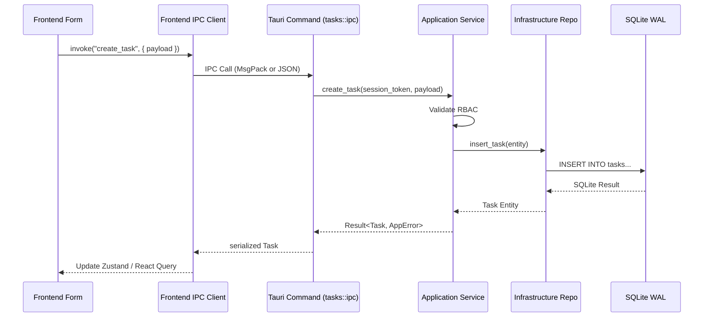

# Architecture & Dataflows

RPMA v2 follows a strict 4-Layer Domain-Driven Design (DDD) architecture split between a Next.js frontend and a Rust/Tauri backend.

## 4-Layer Backend Architecture

Found under `src-tauri/src/domains/[domain_name]/`:

1. **IPC Layer (`ipc/`)**: Tauri command handlers. Purely for serialization, routing, and checking `session_token`.
2. **Application Layer (`application/`)**: Use cases, transaction boundaries, orchestrating multiple domain operations.
3. **Domain Layer (`domain/`)**: Pure Rust structs, traits, value objects, and core business rules. No I/O.
4. **Infrastructure Layer (`infrastructure/`)**: SQLite repositories, raw SQL queries, external HTTP adapters.

---

## Key Data Flows

### 1. Task Creation Flow

### 2. Intervention Workflow (Start/Advance)
- **Entry**: `frontend/src/app/interventions/[id]/page.tsx`
- **Call**: Calls an IPC command to `start_intervention` or `complete_step`.
- **Domain logic**: The `interventions/domain` layer verifies if all prerequisite steps are done before advancing status.
- **Audit**: Application layer triggers an event or directly calls the Audit domain to log the step completion.

### 3. Calendar Scheduling Flow
- **Entry**: `frontend/src/app/schedule/`
- **Logic**: Reads Task scheduled dates. Updating a task via drag-and-drop triggers a `reschedule_task` IPC command.

## Offline-First & Sync Patterns
- **Local SQLite**: The primary data source is the local SQLite database configured in WAL mode for high read/write concurrency.
- **Sync / Event Bus**: (TODO: verify in `src-tauri/src/domains/sync/` or `src-tauri/src/shared/` for event-bus/queue implementations).
- All changes apply locally immediately and are eventually shipped (if sync to cloud is configured).
